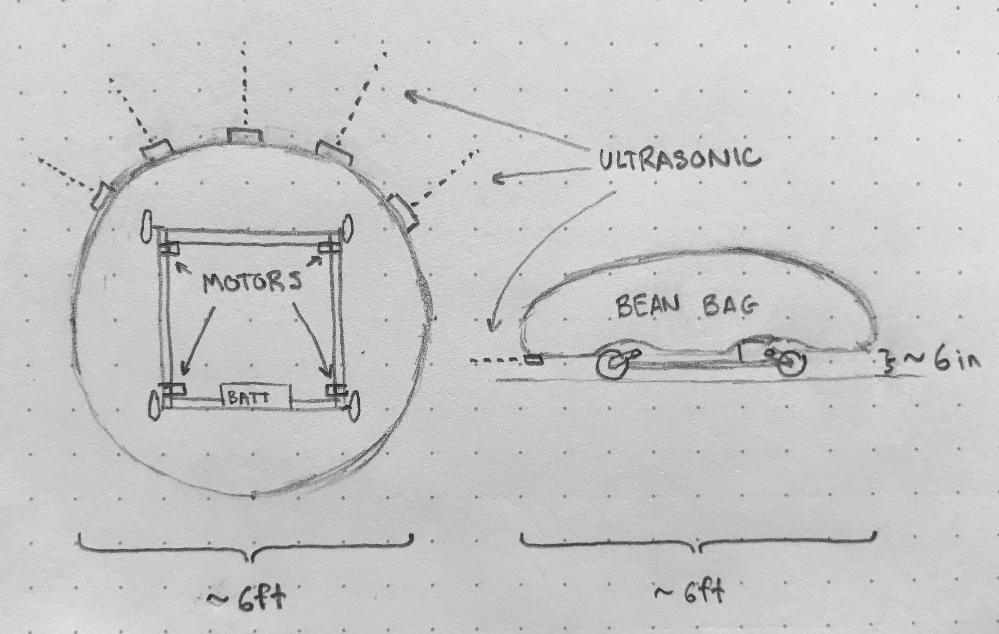

# beanbagbot

Building a mobile beanbag as a public art piece which aims to make Brown University’s open spaces more interesting and social.

## Description

The BeanBagBot will be a large beanbag chair mounted on a low-to-the-ground chassis. The chassis should be low enough that it is barely visible below the edge of the bag (4-6 inches tall). The vehicle will drive around slowly (\~2mph) so that users can safely and easily get on or off the beanbag.

The chassis will constructed from T-slot aluminum, with plywood paneling to support the beanbag. The chassis will have four small wheels, each belt-driven by low-power brushless electric motors. An onboard Raspberry Pi will host a WiFi network, enabling control via a local webapp. Ultrasonic sensors on the chassis will enable the vehicle to stop automatically before colliding with obstacles. A stretch goal is to outfit the Raspberry Pi with a GPS, enabling autonomous wandering within a geofenced area such as the Ruth Simmons green.

## Community Impact Goals

Community Impact Goals
Beanbags seem to help people lower their guard, and foster connections. There is a large beanbag in my house which — perhaps for novelty or nostalgia — has become the prefered place to sit in the living room over a number of couches and chairs. As such, when we have guests over, more often than not they find themselves sitting in close proximity on the beanbag, typically resulting in introductions.

The goal of the BeanBagBot is to bring this unusual social lubricant into the outdoors in an interesting and hopefully comedic way. The unlikely presence of a large beanbag slowly ambling over the grass on the main green on a warm spring day will surely draw attention. Spectators will want to ride the bag, prompting introductions and new connections. I think this moving, interactive art piece will make Brown’s open spaces more exciting, thought-provoking, and social.

Aside from the impact of the completed vehicle, I think the construction of the BeanBagBot will be an opportunity to collect a small group of robotics and design enthusiasts. A number of underclassmen have expressed interest in the project, and I am excited to work with them. I can pass the robot off to them when I graduate, and hopefully the experience they get in bringing the BeanBagBot to life will give them more confidence to pursue projects on their own in the future.

_This project was funded jointly by the Brown Design Workshop and Brown Humanity Centered Robotics Initiative_

## Requirements

 * [Lightweight Communications Martialling (LCM)](https://lcm-proj.github.io/)
 * Flask
 * flask_socketio
 * pigpio